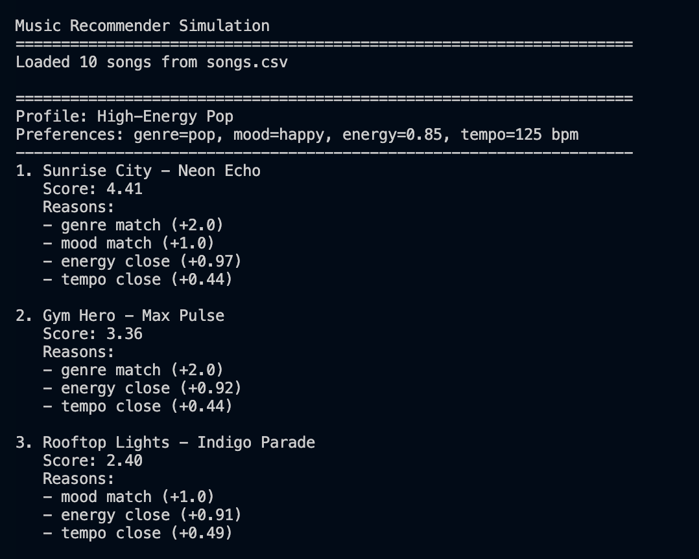
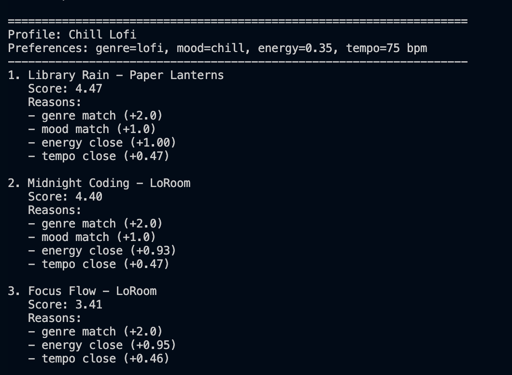
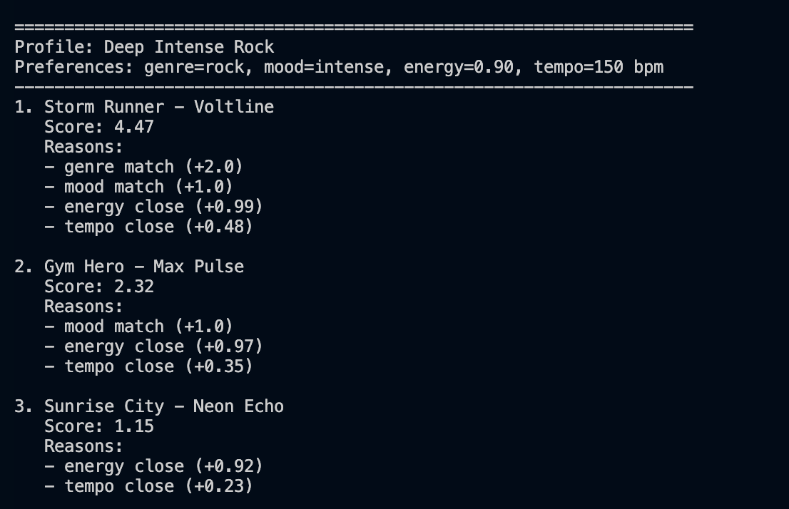
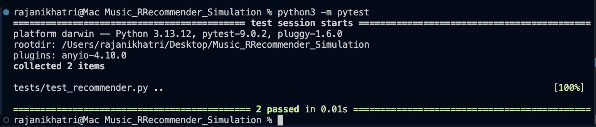

# Music Recommender Simulation

## What Is a Recommender System?

A recommender system is a program that tries to suggest things a user will probably like. In music apps, this can be based on song features, listening history, or patterns from other users. This project uses a simple content-based approach, which means it looks at the features of the songs instead of past user behavior.

## How Real Recommender Systems Work

Platforms like Spotify, YouTube, and TikTok use recommender systems to suggest songs, videos, or posts that a user might enjoy. They do this by looking at what people interact with and by looking at what the content is like.

One common idea is collaborative filtering. This means the system recommends something based on what similar users liked. It uses behavior data such as likes, watch history, playlists, follows, or listening activity. Another common idea is content-based filtering. This means the system recommends items based on features such as genre, mood, energy, or tempo. It focuses more on what the user already seems to like.

- Collaborative filtering: based on users and their behavior
- Content-based filtering: based on item features
- Real platforms usually combine both methods instead of using only one

## Project Summary

This project is a small content-based music recommender written in Python. It loads songs from `data/songs.csv`, compares each song to a user preference profile, gives every song a score, and returns the top matches with human-readable reasons.

Real recommendation systems are usually much bigger than this. Apps like Spotify or YouTube often combine user history, behavior from many users, and content features. This project only simulates one simple part of that idea: matching song features to what a user says they want.

## How The System Works

Real recommender systems often use different kinds of data to predict what users may like. They might look at user behavior, item details, or both. This project uses a simple content-based approach instead of a large real-world system.

In this project, the recommender compares a user's preferences with the features of each song and gives every song a score. The higher the score, the better the match.

The features used in this project are:

- `genre`
- `mood`
- `energy`
- `tempo_bpm`

The scoring recipe is:

- Genre match = `+2.0`
- Mood match = `+1.0`
- Energy closeness = up to `+1.0`
- Tempo closeness = up to `+0.5`

This means exact genre and mood matches get clear bonus points, while energy and tempo are rewarded when they are close to the user's target. One limitation is that the system can over-prioritize genre, especially because the dataset is small.

## What This Project Simulates

This is a beginner-friendly simulation of a content-based recommender. It does not learn from listening history. Instead, it uses a transparent scoring rule that is easy to explain in class and easy to trace by hand.

## Biases and Limitations

- The catalog is very small, so the recommender can only choose from a few songs.
- It only uses a few features and ignores things like lyrics, vocals, language, and personal history.
- If a genre or mood is rare in the dataset, the system may not serve that taste very well.
- The hand-made scoring weights reflect my design choices, so they can favor some matches more than others.

## How to Run

Run the project from the repo root:

```bash
python -m src.main
```

Run the tests:

```bash
pytest
```

## Example Profiles

`src/main.py` includes three sample profiles:

- High-Energy Pop
- Chill Lofi
- Deep Intense Rock

These profiles make it easy to show different recommendation results in the terminal.

## Terminal Output Screenshots

These screenshots show example recommendations for multiple user profiles in the terminal, plus optional test output.

Save the screenshot files in: `images/`

### High-Energy Pop



### Chill Lofi



### Deep Intense Rock



### Test Results



## Extra Documents

- [Model Card](model_card.md)
- [Reflection](reflection.md)
